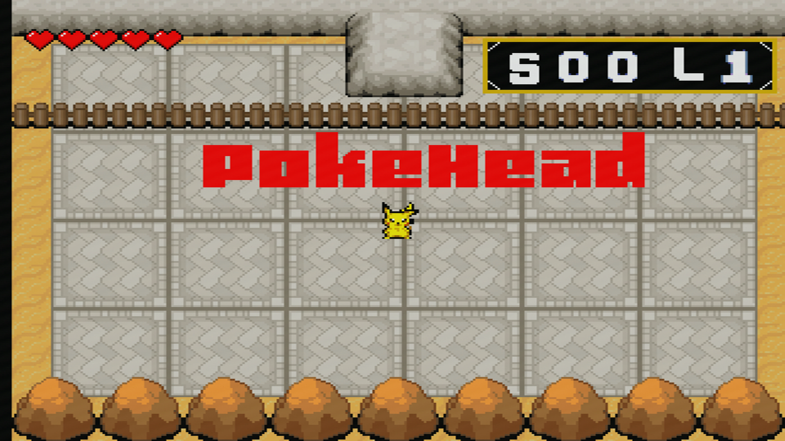
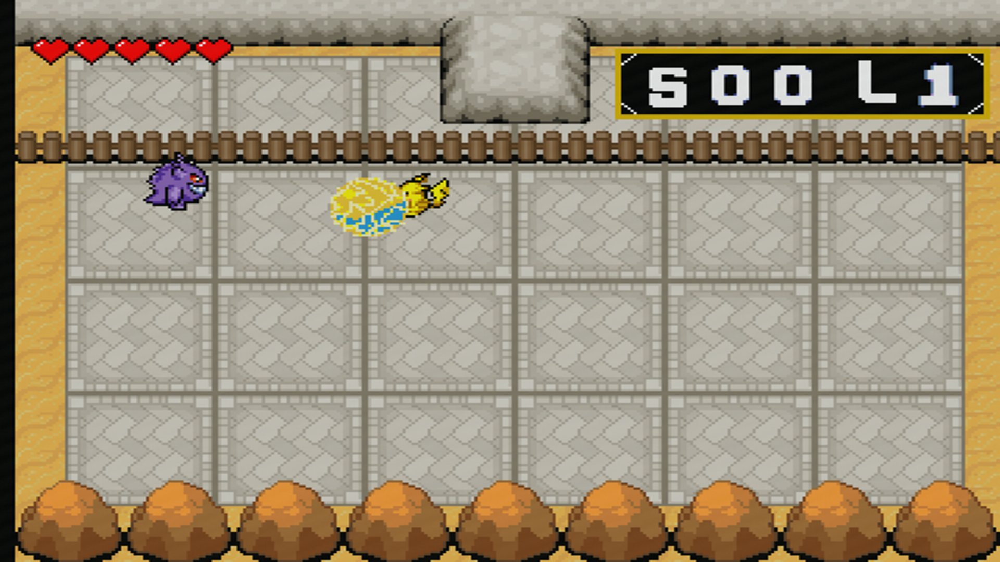
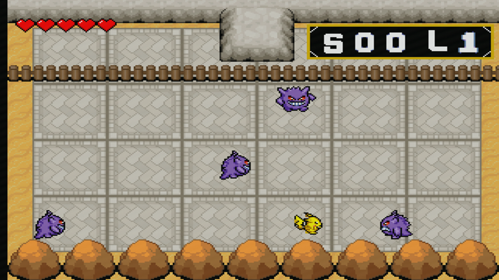
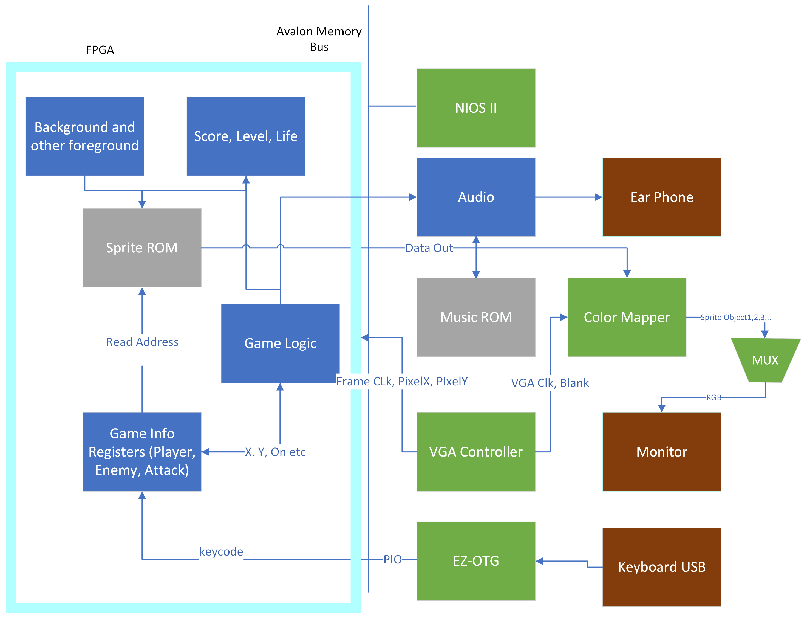

# ECE385_SP23_ZJUI

## Introduction

All ECE385 labs and final project "Pokehead", a simple yet fancy shooting game with inspiration from "BoxHead" but with "Pokemon" theme that runs on FPGA.

## Features 

- VGA display
- Fancy Character Movement and Interaction
- Score recording and game level change. Endless game!
- Audio and sound effect
- Multiplayer 

## How to play

| Function                | Keyboard Press                                                        |
|-------------------------|-----------------------------------------------------------------------|
| Reset Game              | Reset button on DE-2 board                                            |
| Start Game              | Space                                                                 |
| Move Player             | Up; Down; Left; Right                                                 |
| Ball Lighting Attack    | X                                                                     |
| Flash Lighting Attack   | Z (unlocked after level 3)                                               |
| Toggle Multiplayer mode | G                                                                     |
| Move Enemy              | W;S;A;D                                                               |
| Cheat code              | In this order: Up,Up, Down,Down, Left, Right, Left, Right, Z, X, Z, X (huh, I got thirty lives!) |

## Setup

All sources code are provided in directory `boxhead/sv/` and the compiled sof file is also provided in `boxhead/boxhead.sof`.   
The setup step is the same as lab8, but make sure a headphone is also connected.

## Design Diagram

For more information about the final project, please refer to the [final report](./reports/final_report.pdf)

## Academic Integrity Statement
By submitting your own lab with this statement, you declare you have written up the lab entirely by yourself, including both code and markdown cells. You also agree that you should not share your code with anyone else. Any violation of the academic integrity requirement may cause an academic integrity report to be filed that could go into your student record. See Students' Quick Reference Guide to Academic Integrity for more information.

**Don't Copy and Cheat in ZJU UIUC courses**

